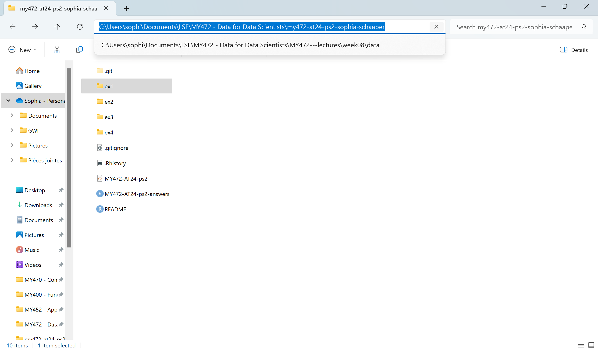

```{r setup, include=FALSE}
# this chunk contains code that sets global options for the entire .Rmd. 
# we use include=FALSE to suppress it from the top of the document, but it will still appear in the appendix. 

knitr::opts_chunk$set(echo = FALSE) # actually set the global chunk options. 
# we set echo=FALSE to suppress code such that it by default does not appear throughout the document. 
# note: this is different from .Rmd default
```

<!-- DO NOT EDIT THIS LINE OR ANYTHING ABOVE IT, EXCEPT PUTTING YOUR CANDIDATE NUMBER AT THE TOP. ALL OF YOUR WORK SHOULD BE COMPLETED BELOW HERE. -->

#### Part 1.
This is how I cloned my Submission Repo to my local machine.

```{bash clone repo, eval=FALSE, echo=TRUE}

git clone https://github.com/lse-my472/my472-at24-ps2-sophia-schaaper.git

```

I then created new folders for each exercise. 

```{r create folders, eval=FALSE, echo=TRUE, warning=FALSE}

#make sure we are in the original directory
setwd("C:/Users/sophi/Documents/LSE/MY472 - Data for Data Scientists/my472-at24-ps2-sophia-schaaper")

num_ex <- 4

template_file <- "MY472-AT24-ps2-answers.Rmd"

for (i in seq_len(num_ex)) {
  if (!dir.exists(paste0("ex", i))) {
    dir.create(paste0("ex", i), showWarnings = FALSE)
  }
  
  folder_name <- paste0("ex", i)
  
  file_name <- file.path(folder_name, paste0("MY472-AT24-ps2-", folder_name, "-answers.Rmd"))

  if (!file.exists(file_name)) {
    file.copy(template_file, file_name)}
  }

#once used, can be removed
rm(num_ex)
rm(template_file)

#once created, switch to ex1 directory
setwd("C:/Users/sophi/Documents/LSE/MY472 - Data for Data Scientists/my472-at24-ps2-sophia-schaaper/ex1")

```


#### Part 2.

Below is a screenshot depicting the contents of the folder containing my local Submission Repo. The folder includes folders for each exercise: `ex1`, `ex2`, `ex3`, and `ex4`, along with the instructions for this assignment (`MY472-AT24-ps2`), the `README` file with various formatting instructions, and the original `MY472-AT24-ps2-answers` file, which is copied into each exercise folder and renamed to `MY472-AT24-ps2-ex1-answers`, `MY472-AT24-ps2-ex2-answers`, `MY472-AT24-ps2-ex3-answers`, and `MY472-AT24-ps2-ex4-answers`, with the answers for each exercise, respectively.



#### Part 3.

This table shows the potential encoding and their associated confidence level. We can see that Shift_JIS has a confidence of `1.00`, as opposed to windows-1252 which has a confidence level of 0.23, meaning Shift_JIS is the most likely encoding.

```{r find encoding, echo=TRUE}
library(readr)
guess_encoding("TextFile.txt")
```
This is a congratulatory message, dated November 6, in Japanese, from the Japanese Prime Minister Ishiba to President Trump for his victory in the election. He expresses his commitment to strengthening the US-Japan alliance in order to promote a "free and open Indo-Pacific".

```{r change encoding to UTF-8, echo=TRUE}
textfile <- read_file("TextFile.txt", locale = locale(encoding = "Shift-JIS"))
textfile <- parse_character(textfile, locale = locale(encoding = "UTF-8"))
textfile
```

<!-- DO NOT EDIT THIS LINE OR ANYTHING BELOW IT. ALL OF YOUR WORK SHOULD BE COMPLETED ABOVE. -->

## Appendix: All code in this assignment

```{r ref.label=knitr::all_labels(), echo=TRUE, eval=FALSE}
# this chunk generates the complete code appendix. 
# eval=FALSE tells R not to run (``evaluate'') the code here (it was already run before).

#changed to echo = F, because the instructions say: "For this entire exercise, include any code chunk(s) directly in your answer, and not in the appendix."

```
